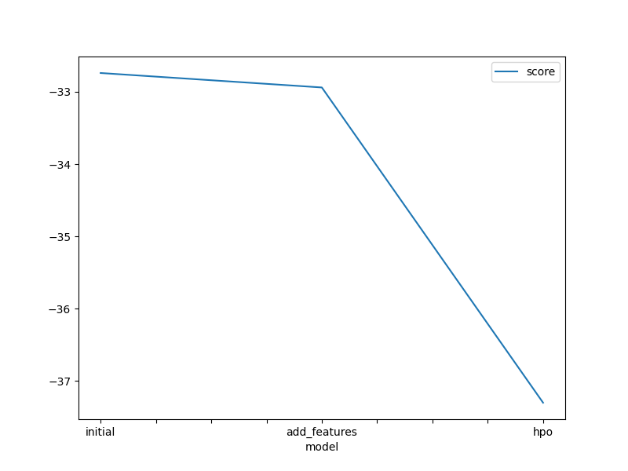
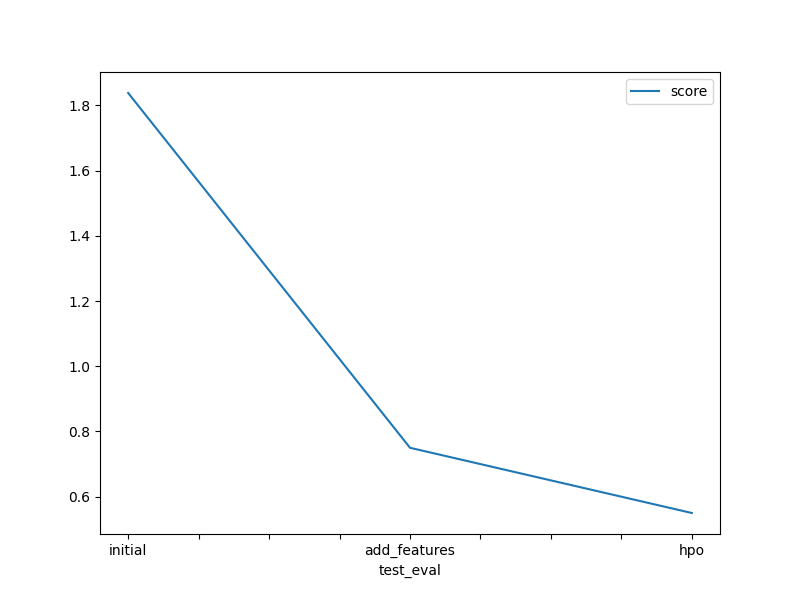

# Report: Predict Bike Sharing Demand with AutoGluon Solution
#### Omar Daniel Lopez Olmos

## Initial Training
### What did you realize when you tried to submit your predictions? What changes were needed to the output of the predictor to submit your results?
A: The submission dataset was incomplete, it was missing most of the predictor variables. After exploring the shape and the unique values in the submission and the test dataset I infered that a new dataset could be created by joining both datasets, the 'datetime' columun was present in both datasets so I joined them on this column.

### What was the top ranked model that performed?
TODO: A WeightedEnsemble_L2 model with HPO setting custom hyperparameters for both the GBM and NN models, and setting the searcher to automatic.

## Exploratory data analysis and feature creation
### What did the exploratory analysis find and how did you add additional features?
A: Four new variables were created from the original timedate: 1)year, 2)month, 3)day, and 4)time.

### How much better did your model perform after adding additional features and why do you think that is?
TODO: The Kaggle score improved from 1.838 to 0.75. By adding new ranges of time, new intervals of values are created, these new features may add more predictive power to train the algorithms. In other words, it's easier to predict on specific time signatures than it is from a single timestamp i.e., multiple vs one feature.

## Hyper parameter tuning
### How much better did your model perform after trying different hyper parameters?
TODO: The first attempt of HPO did not yield better results than when adding new features (kaggle socre=1.79), but in the final HPO we used several parameters and individual model hyperparameters for the GBM and NN algorithms and showed an improvement in our predictions based the kaggle score achieving a score of 0.55.

### If you were given more time with this dataset, where do you think you would spend more time?
A: I would try to find the most significant variables, maybe try a Random Forest algorithm and extract the top few predictors. By reducing the number of features we can achieve a more efficient prediction and training of further more powerful models, having in mind that with these new set of features, the top model might be a different algorithm from what we've seen with the complete set of features. I'd also explore the TabularPredictor parameters and specific model hyperparameters to find the most computationally efficient way to train the models while keeping predictive performance. AutoGluon has options to optimize model trainig for deployment, it would be interesting to compare the predictive power of these models.

### Create a table with the models you ran, the hyperparameters modified, and the kaggle score.
|model|hpo1|hpo2|hpo3|score|
|--|--|--|--|--|
|initial|hyperparameters: 'default'|parameters: 'default'|hyperparameter_tune_kwargs: 'default'|1.838|
|add_features|hyperparameters: 'default'|parameters: 'default'|hyperparameter_tune_kwargs: 'default'|0.75|
|hpo|hyperparameters: 'default' |parameters: num_trials:5, searcher:'auto'|hyperparameter_tune_kwargs: 'GBM: num_boost_round:150, num_leaves:space.Int(26,66,3) NN_TORCH: epochs:10, learning_rate: space.Real(1e-4, 1e-2, 5e-4, log=True), activation: space.Categorical.([100], [1000], [200, 100], [300, 200, 100], dropout_prob: space.Real(0.0, 0.5, 0.1))'|0.55|

### Create a line plot showing the top model score for the three (or more) training runs during the project.

TODO: Replace the image below with your own.

### Create a line plot showing the top kaggle score for the three (or more) prediction submissions during the project.

TODO: Replace the image below with your own.

## Summary
TODO: Overall model ensembling were among the top scoring models in all runs (as expected by the capabilities of ensemble models). All except our 3rd HPO run top-ranked ensemble models with 3 stacked models (L3 and L2). From observing the local trainig score and Kaggle scores carefully whe came to the the realization that our models are slightly overfitting, getting better results with the testing dataset (sumbission) than with the training dataset. Adding new features to the training data did improve model's performances by around ~100%. Despite this improvement being less intense with  hyperparameter tuning it is certainly a strategy worth trying and expanding the search space in order to optimize predictive power.
